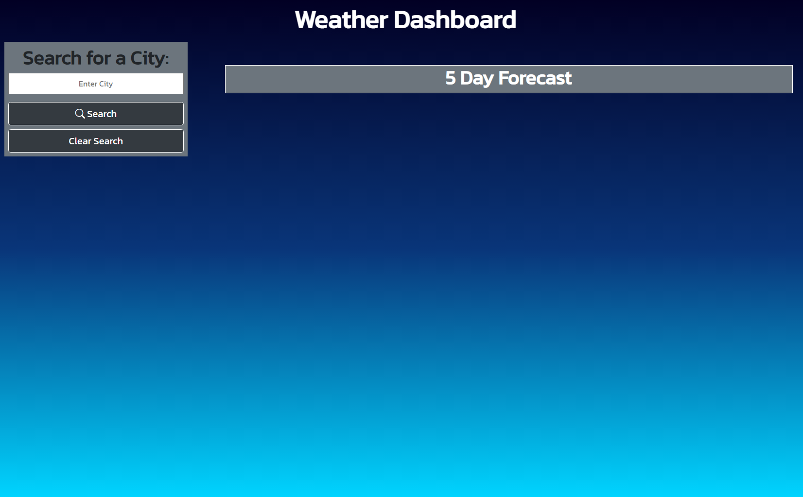
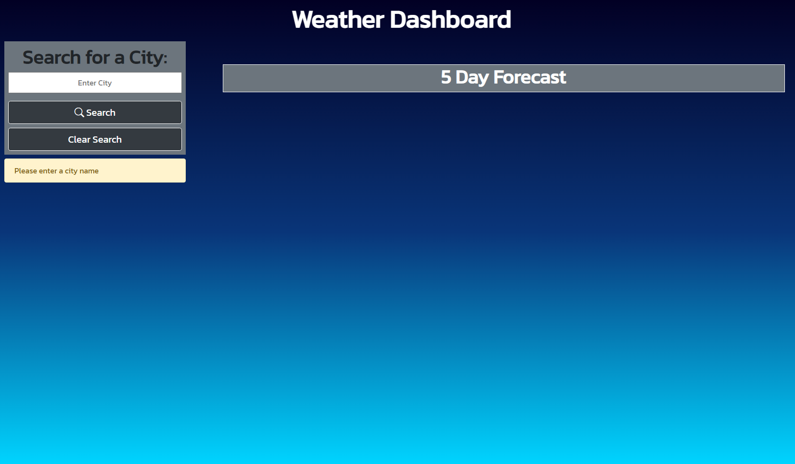
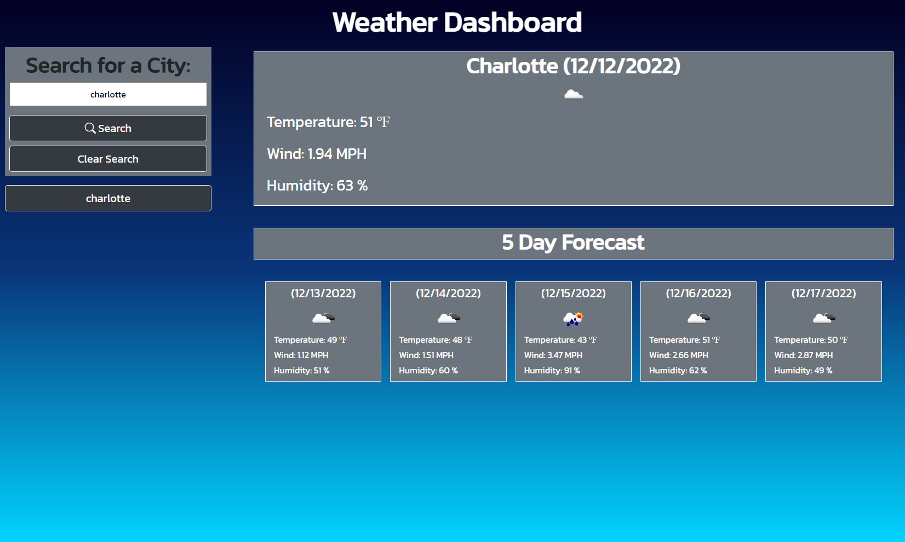
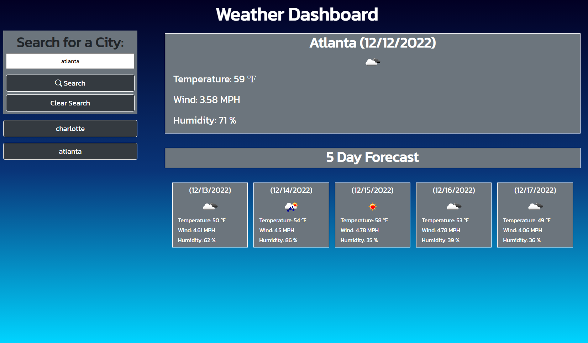

# 5 day weather forecast api

[Link to my project](https://cujion.github.io/5-day-weather-forecast-api/)

## Table of Contents
- [Description](#description)
- [Visuals](#visuals)
- [License](#license)

## Description
* This application is an open weather api that allows you to search any city in the search input and it will display the current days weather as the main content area along with the following five day forecast below. This application uses an abundance of third party apis including dayjs to display the date, google font, jquery, along with bootstrap for easier html and javascript styling. This server sided open weather api allows you to understand how to manipulate data given to you through fetch and requests and then being able to understand what information you need from the data given and then displaying it on the webpage.  

## Visuals

## License
* MIT License

* Copyright (c) [2022]] [Christopher Bonime]

* Permission is hereby granted, free of charge, to any person obtaining a copy
of this software and associated documentation files (the "Software"), to deal
in the Software without restriction, including without limitation the rights
to use, copy, modify, merge, publish, distribute, sublicense, and/or sell
copies of the Software, and to permit persons to whom the Software is
furnished to do so, subject to the following conditions:

* The above copyright notice and this permission notice shall be included in all
copies or substantial portions of the Software.

* THE SOFTWARE IS PROVIDED "AS IS", WITHOUT WARRANTY OF ANY KIND, EXPRESS OR
IMPLIED, INCLUDING BUT NOT LIMITED TO THE WARRANTIES OF MERCHANTABILITY,
FITNESS FOR A PARTICULAR PURPOSE AND NONINFRINGEMENT. IN NO EVENT SHALL THE
AUTHORS OR COPYRIGHT HOLDERS BE LIABLE FOR ANY CLAIM, DAMAGES OR OTHER
LIABILITY, WHETHER IN AN ACTION OF CONTRACT, TORT OR OTHERWISE, ARISING FROM,
OUT OF OR IN CONNECTION WITH THE SOFTWARE OR THE USE OR OTHER DEALINGS IN THE
SOFTWARE.